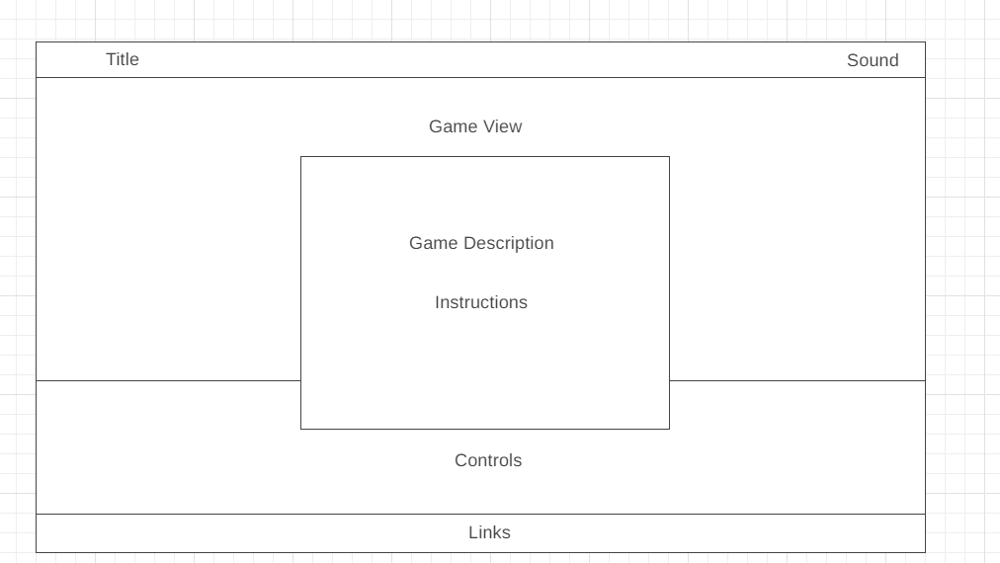

# JSProject

## Background
<!-- **bobabreak** is a tea-themed matching game where the player serves as a barista in a bubble-tea shop newly opened in the bustling city of Los Angeles. Hone your barista skills as you serve customers the drink of their dreams and collect revenue to keep your shop open!  -->

**bobabreak** is a tea-themed matching game where the player serves as a barista in a bubble-tea shop newly opened in the bustling city of Los Angeles. Hone your barista skills as you take orders and serve customers the drink of their dreams!

## Instructions

**bobabreak** is a tea-themed food matching game. The player will take on the role of the barista that makes the bubble tea orders to serve the correct drink to the customer. Players can use the keyboard or mouse to select components of the drink. Players will have to choose the right cup-size, tea, and the toppings in order to pass the round. The time allotted for each drink order will decrease after a certain amount of customers to increase difficulty over the course of gameplay. The player will be given three lives. A wrong order or order not completed in time will result in a customer lost, aka life lost. Losing all three lives will result in a game over. 

## Live
Play **bobabreak** live [here](https://meih15.github.io/bobabreak/)

## Functionality & MVPS

In **bobabreak**, players will be able to:
- Start a new game and restart the game
- Mute any sounds from the game
- Use the keyboard or mouse to select each drink's ingredients
- Collect money for serving the correct drink to customers
- Change their store's status once you reach a certain amount of revenue
- Lose a customer for each missed bubble tea order
- Lose the game when you lose 3 customers

In addition, this project includes:
- Instructions on how to play
- Options to play different Asian music

## Wireframes

## Technologies, Libraries, APIs
- Javascript
- NPM and Webpack
- HTML/CSS

## Implementation Timeline
- Friday: Project setup and outlining the game logic
- Weekend: Complete the game logic functionality
- Monday: Complete the game interface
- Tuesday: Include HTML buttons functionality and music options
- Wednesday: Finish styling, and clean up code
- Thursday Morning: Deploy to Github pages

## Credits
Images and Music